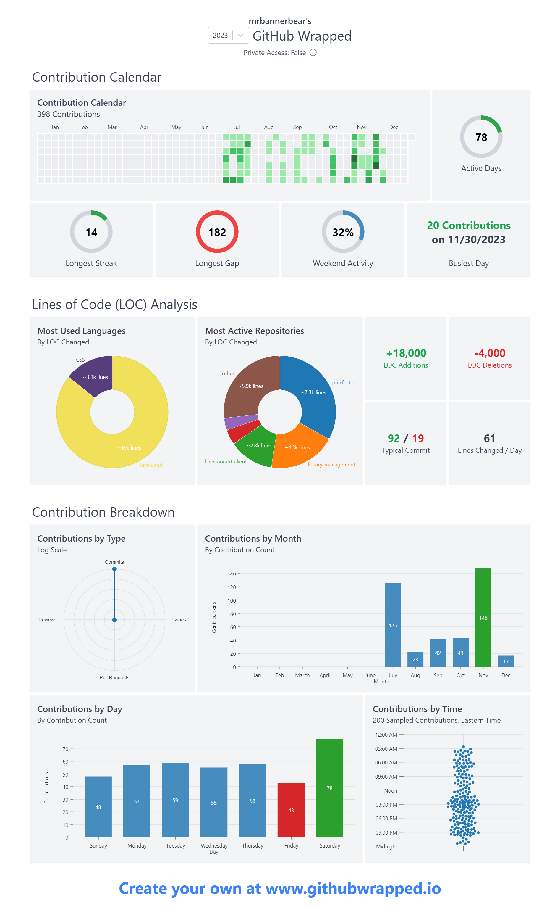

  

Here are some ideas to get you started:

  

-  🌱 I’m currently learning **Next.js**

-  📫 You can reach me out on my [email](www.sayedsaqlayn@gmail.com)

  ## :computer: Tech Stack

  
  ## :chart_with_upwards_trend: Stats

